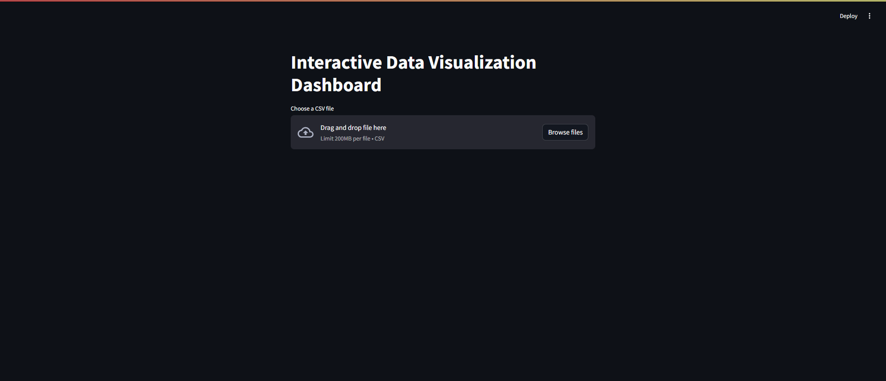
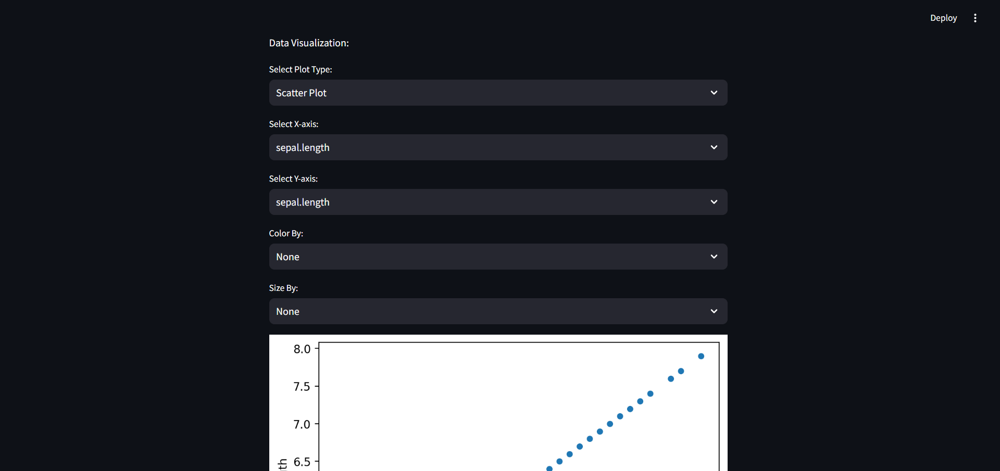
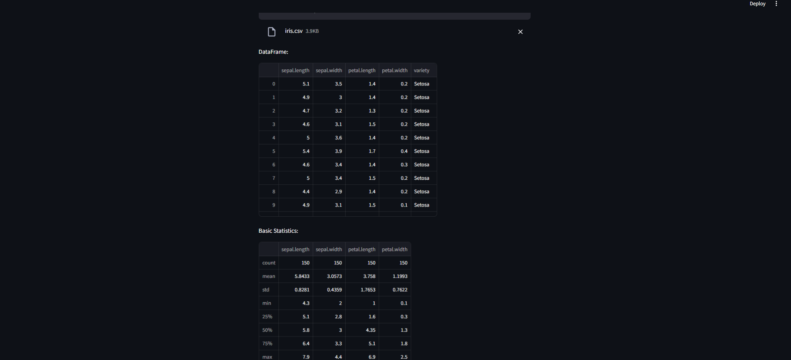

# Interactive Data Visualization Dashboard

This repository contains a Streamlit-based web application for interactive data visualization. The app allows users to upload CSV files, explore datasets, and visualize data through various types of plots. 

## Features

- **Scatter Plot**: Interactive scatter plots with customizable color and size.
- **Histogram**: Visualize the distribution of a selected column.
- **Pair Plot**: Create pair plots for multiple columns to analyze relationships.
- **Correlation Matrix**: Display a heatmap of the correlation matrix.
- **Box Plot**: Visualize the distribution of values in a selected column.
- **Download Processed Data**: Download the processed DataFrame as a CSV file.

## Installation

1. **Clone the repository**:
    ```bash
    git clone https://github.com/abdu1qadeer/DataVisualizationApp.git
    ```
   
2. **Navigate to the project directory**:
    ```bash
    cd DataVisualizationApp
    ```

3. **Install the required dependencies**:

## Usage

1. **Run the Streamlit app**:
    ```bash
    streamlit run app.py
    ```

2. **Upload your CSV file**:
   - Use the file uploader in the app to upload your CSV file.

3. **Explore and visualize your data**:
   - Choose from various plot types to visualize your data:
     - Scatter Plot
     - Histogram
     - Pair Plot
     - Correlation Matrix
     - Box Plot

4. **Download the processed data**:
   - Use the download button to download the processed DataFrame as a CSV file.

## Example

Here's an example of how to use the app:

1. **Upload a CSV file**:
   

2. **Select plot type and columns**:
   

3. **Visualize the data**:
   

## Dependencies

- pandas
- seaborn
- matplotlib
- streamlit

## Contact

If you have any questions or suggestions, please feel free to contact me.

---
